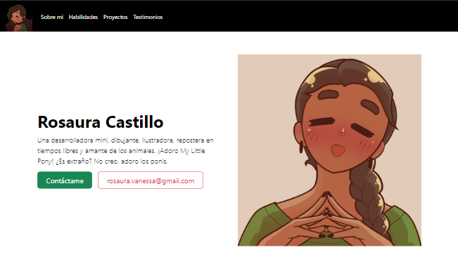
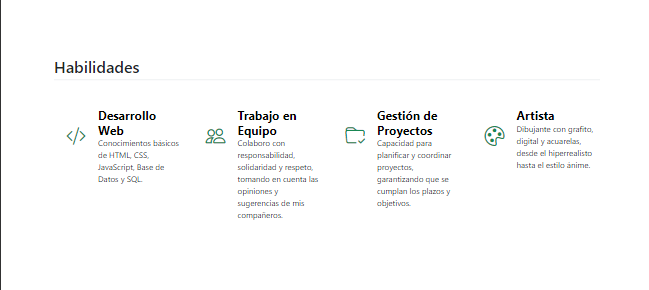
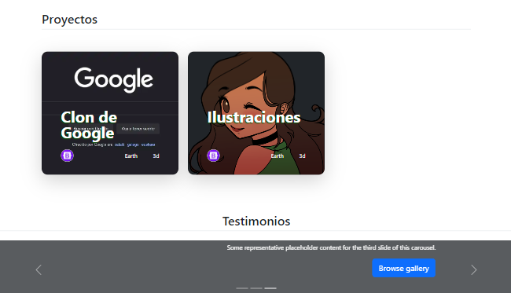
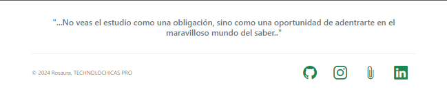

# Mi portafolio de habilidades TECNOLOCHICAS PRO

El presente proyecto es un portafolio desarrollado para poner en práctica las habilidades dentro del bootcamp de desarrollo frontend de Tecnholochicas PRO.

Fue desarrollado con HTML, CSS y JS con el uso del framework de UI, Bootstrap utilizando además bibliotecas externas.

La página es responsiva (adaptable a diferentes tamaños de pantalla) e incluye la presentación de la autora del proyecto.

## Secciones de mi sitio

### Presentación

### Habilidades

### Proyectos y testimonios

### Contacto

## Tecnologías

* HTML
* CSS
* Bootstrap
* Javascript

---

Desarrollado con amor :cupid: por [Rosaura](https://www.instagram.com/rovacach_03?igsh=MWN0Z3pha2J5YnVxaw==) en [Tecnhnolochicas PRO](https://tecnolochicas.mx)
